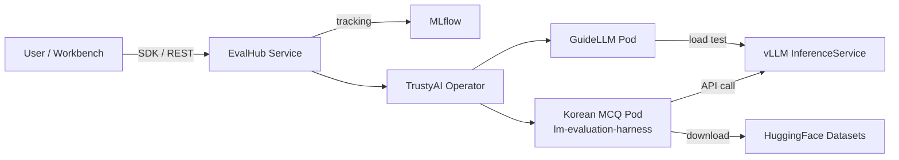
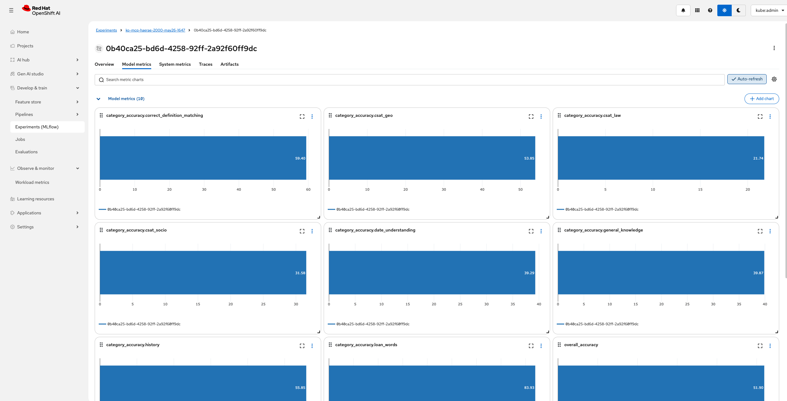

# RHOAI LMEval Builder Lab

A hands-on workshop for running **Korean language evaluation benchmarks** on **Red Hat OpenShift AI** using the TrustyAI `LMEvalJob` Custom Resource. This lab guides you through evaluating open-weight LLMs on datasets like KMMLU, CLIcK, KoBEST, and HAE-RAE directly from your OpenShift AI environment.

## Architecture



**How it works:**

- **GuideLLM (Phase 1):** Run inference performance benchmarks using [GuideLLM](https://github.com/neuralmagic/guidellm) through EvalHub to measure TTFT, ITL, throughput, and end-to-end latency.
- **Korean MCQ (Phase 2):** Run individual Korean MCQ benchmarks (KMMLU, CLIcK, HAE-RAE, etc.) through the EvalHub SDK with MLflow tracking. Summarize and export results as Markdown/HTML reports.
- **Unified Evaluation (Phase 3):** Run multi-benchmark evaluations and unified accuracy + performance (Korean MCQ + GuideLLM) experiments under a single MLflow experiment, with comparison tables and visualization.

## Model

This workshop uses **Gemma 4 (E2B-it)**, **Qwen3-4B**, and **Qwen3-14B** deployed on OpenShift AI via a custom vLLM ServingRuntime as target models for evaluation. The setup notebook includes instructions for deploying models with GPU support.

## What's Included

### 0. Setup

- **0_setup/0_model_deploy.ipynb**: Deploy a Gemma 4 model using a custom vLLM ServingRuntime with NVIDIA GPU support.
- **0_setup/1_LMEval_setup.ipynb**: Configure RBAC permissions, create secrets (HF token, SA token for OAuth), and verify cluster access for LMEvalJob.
- **0_setup/2_eval_hub_setup.ipynb**: Deploy the EvalHub service and MLflow on OpenShift, install the eval-hub-sdk, and verify connectivity.

### 1. GuideLLM Performance Benchmark (Phase 1)

- **1_eval_hub_guidellm_benchmark/1_guidellm_benchmark.ipynb**: Run inference performance benchmarks using GuideLLM through EvalHub SDK. Measures TTFT, ITL, throughput, and end-to-end latency with multiple execution profiles (quick baseline, rate sweep, constant load).

### 2. Korean MCQ Benchmark (Phase 2)

- **2_eval_hub_kmcq_benchmark/1_kmcq_benchmark.ipynb**: Run a single Korean MCQ benchmark (e.g. KMMLU, CLIcK, HAE-RAE) through EvalHub SDK with MLflow tracking. Includes job management and result export.
- **2_eval_hub_kmcq_benchmark/2_summarize_results.ipynb**: Load results from `results/<model>/`, build comparison tables, aggregate by category/supercategory, and export to Markdown and HTML reports.
- **2_eval_hub_kmcq_benchmark/generate_report.py**: Generate a standalone HTML report with interactive Chart.js visualizations and comparison tables.

### 3. Unified Evaluation (Phase 3)

- **3_eval_hub_unified_benchmark/1_unified_benchmark.ipynb**: Run multi-benchmark evaluations, sample size comparisons, and unified accuracy + performance (Korean MCQ + GuideLLM) experiments under a single MLflow experiment. Includes MLflow integration, comparison tables, and result export.

## Korean Benchmark Datasets

| Dataset | Description | Categories | Samples |
|---------|-------------|------------|---------|
| **KMMLU** | Korean Massive Multi-task Language Understanding | 45 subjects (STEM, HUMSS, Applied Science) | 35,030 |
| **CLIcK** | Cultural and Linguistic Intelligence in Korean | 11 categories (Culture + Language) | 1,995 |
| **KoBEST** | Korean Balanced Evaluation of Significant Tasks | WiC, CoPA, BoolQ, HellaSwag, SentiNeg | 6,100+ |
| **HAE-RAE** | Korean Language Proficiency Benchmark | 6 categories (General Knowledge, History, etc.) | 1,538 |

## Evaluation Results

We evaluated **Gemma 4 (E2B-it)**, **Qwen3-4B**, and **Qwen3-14B** on 5 Korean benchmarks using the custom `korean-mcq` EvalHub adapter with up to 2,000 samples per dataset. Evaluations were orchestrated via EvalHub SDK, with results tracked in MLflow.

For Qwen3-4B, **MLflow Tracing** is enabled — each LLM call (prompt/response) is recorded as a structured trace span via `MlflowClient.start_trace()` API, visible in the MLflow UI's Traces tab. This is achieved by connecting the adapter pod directly to the MLflow service (bypassing the EvalHub proxy which only supports MLflow 2.0 API).



| Benchmark | Gemma4-E2B | Qwen3-4B | Qwen3-14B | Samples |
|:----------|-------:|-------:|-------:|-------:|
| CLIcK | 56.11% | 56.66% | 66.82% | 1,995 |
| HAE-RAE Bench 1.1 | 51.90% | 46.22% | 54.64% | 2,000 |
| KMMLU (0-shot) | 36.45% | 35.70% | 48.30% | 2,000 |
| KMMLU-HARD (0-shot) | 23.70% | 21.88% | 27.95% | 2,000 |
| KoBEST BoolQ | 85.90% | 86.18% | 93.23% | 1,404 |


Accumulated benchmark results across major open-weight models are maintained at:

> **[evaluate-llm-on-korean-dataset](https://github.com/hyogrin/evaluate-llm-on-korean-dataset)**

This companion repository tracks performance of models like Gemma, Llama, Phi, Qwen, and others on Korean evaluation datasets with detailed per-category breakdowns and radar chart visualizations.

## Prerequisites

- Red Hat OpenShift AI cluster with TrustyAI Operator installed
- A model deployed via KServe (vLLM runtime) with OAuth auth enabled
- `oc` CLI access to the cluster
- Hugging Face API token
- (Phase 1–3) EvalHub service and MLflow deployed on the cluster

## Quick Start

1. Clone this repo into your OpenShift AI Workbench:
   ```bash
   git clone https://github.com/hyogrin/lm-eval-builder-lab.git
   cd lm-eval-builder-lab
   ```

2. Install dependencies with [uv](https://docs.astral.sh/uv/):
   ```bash
   uv sync
   source .venv/bin/activate
   ```

3. Copy and fill in environment variables:
   ```bash
   cp sample.env .env
   # Edit .env with your values
   ```

4. Run notebooks in order:
   - `0_setup/0_model_deploy.ipynb` — Deploy model (skip if already deployed)
   - `0_setup/1_LMEval_setup.ipynb` — One-time RBAC and secrets setup for LMEvalJob
   - `0_setup/2_eval_hub_setup.ipynb` — Deploy EvalHub + MLflow (for Phase 1–2)
   - `1_eval_hub_guidellm_benchmark/1_guidellm_benchmark.ipynb` — Inference performance profiling (TTFT, ITL, throughput)
   - `2_eval_hub_kmcq_benchmark/1_kmcq_benchmark.ipynb` — Single Korean MCQ benchmark evaluation
   - `2_eval_hub_kmcq_benchmark/2_summarize_results.ipynb` — Analyze results and generate Markdown/HTML reports
   - `3_eval_hub_unified_benchmark/1_unified_benchmark.ipynb` — Multi-benchmark + unified accuracy/performance evaluation

> **Note:** `uv sync` creates a `.venv` virtual environment and installs all dependencies defined in `pyproject.toml`. To run scripts directly, use `uv run python <script>` or activate the venv with `source .venv/bin/activate`.

## Phase Comparison

| | Phase 1: GuideLLM | Phase 2: Korean MCQ | Phase 3: Unified |
|---|---|---|---|
| **Approach** | GuideLLM via EvalHub SDK | Single Korean MCQ benchmark | Multi-benchmark + GuideLLM unified |
| **What it measures** | TTFT, ITL, throughput, latency | Accuracy per benchmark | Accuracy + performance combined |
| **Scope** | Performance only | One benchmark at a time | All benchmarks + performance |
| **Experiment Tracking** | Built-in MLflow | Built-in MLflow | Unified MLflow experiment |
| **Best For** | Capacity planning | Quick single-task eval | Production comprehensive eval |

## Detailed Evaluation Results

### CLIcK — Accuracy by supercategory

| supercategory | gemma4-e2b | qwen3-4b | qwen3-14b |
|:---|---:|---:|---:|
| Culture | 57.76 | 56.19 | 65.65 |
| Language | 52.16 | 57.69 | 69.44 |

### CLIcK — Accuracy by category

| category | gemma4-e2b | qwen3-4b | qwen3-14b |
|:---|---:|---:|---:|
| Economy | 72.88 | 66.10 | 81.36 |
| Functional | 58.57 | 61.76 | 82.35 |
| Geography | 65.55 | 61.11 | 71.20 |
| Grammar | 31.67 | 34.80 | 45.18 |
| History | 34.29 | 34.29 | 40.71 |
| Law | 44.75 | 50.23 | 56.16 |
| Politics | 67.86 | 67.86 | 77.38 |
| Pop Culture | 68.29 | 60.98 | 78.05 |
| Society | 71.52 | 70.55 | 80.91 |
| Textual | 67.55 | 75.46 | 84.93 |
| Tradition | 67.12 | 59.01 | 71.17 |

### HAE-RAE — Accuracy by category

| category | gemma4-e2b | qwen3-4b | qwen3-14b |
|:---|---:|---:|---:|
| correct_definition_matching | 59.40 | 50.00 | 83.96 |
| csat_geo | 53.85 | 42.86 | 16.67 |
| csat_law | 21.74 | 29.41 | 40.68 |
| csat_socio | 31.58 | 21.43 | 36.00 |
| date_understanding | 39.29 | 60.09 | 47.58 |
| general_knowledge | 39.87 | 46.00 | 50.29 |
| history | 55.85 | 36.52 | 58.51 |
| loan_words | 83.93 | 78.57 | 92.00 |

### KMMLU — Accuracy by supercategory

| supercategory | gemma4-e2b | qwen3-4b | qwen3-14b |
|:---|---:|---:|---:|
| HUMSS | 31.00 | 45.00 | 50.00 |
| Other | 36.74 | 35.21 | 48.21 |

### KMMLU — Accuracy by category (partial)

| category | gemma4-e2b | qwen3-4b | qwen3-14b |
|:---|---:|---:|---:|
| Accounting | 31.00 | 45.00 | 50.00 |
| Agricultural Sciences | 33.80 | 29.80 | 42.70 |
| Aviation Engineering and Maintenance | 40.00 | 41.22 | 54.33 |

### KMMLU-HARD — Accuracy by supercategory

| supercategory | gemma4-e2b | qwen3-4b | qwen3-14b |
|:---|---:|---:|---:|
| Other | 23.70 | 21.88 | 27.95 |

### KMMLU-HARD — Accuracy by category

| category | gemma4-e2b | qwen3-4b | qwen3-14b |
|:---|---:|---:|---:|
| accounting | 15.22 | 15.22 | 23.91 |
| biology | 14.00 | 14.00 | 23.00 |
| chemistry | 34.00 | 31.00 | 39.00 |
| computer_science | 29.00 | 24.00 | 36.00 |
| criminal_law | 26.00 | 22.00 | 28.00 |
| ecology | 28.00 | 14.00 | 23.00 |
| electrical_engineering | 22.00 | 18.00 | 19.00 |
| electronics_engineering | 22.00 | 28.28 | 43.00 |
| gas_technology_and_engineering | 25.00 | 18.00 | 24.00 |
| geomatics | 30.00 | 17.00 | 25.00 |
| health | 34.78 | 26.09 | 13.04 |
| information_technology | 23.00 | 35.00 | 37.00 |
| korean_history | 9.09 | 20.45 | 18.18 |
| machine_design_and_manufacturing | 17.39 | 21.74 | 26.09 |
| management | 20.00 | 29.00 | 35.00 |
| maritime_engineering | 16.00 | 31.00 | 29.00 |
| materials_engineering | 27.00 | 23.00 | 27.00 |
| math | 20.00 | 12.24 | 20.00 |
| nondestructive_testing | 27.00 | 17.00 | 27.00 |
| patent | 23.53 | 29.41 | 35.29 |
| political_science_and_sociology | 25.56 | 24.44 | 24.44 |
| public_safety | 29.00 | 18.00 | 21.00 |
| railway_and_automotive_engineering | 20.00 | 17.00 | 29.00 |

### KoBEST BoolQ — Accuracy by category

| category | gemma4-e2b | qwen3-4b | qwen3-14b |
|:---|---:|---:|---:|
| unknown | 85.90 | 86.18 | 93.23 |


## About

This workshop was built through real debugging and iteration on OpenShift AI. Key learnings documented:

- LMEvalJob CRD uses `spec.pod.container.env` (singular), not `spec.pod.containers[].env`
- OAuth-protected InferenceServices require RBAC + SA token via `OPENAI_API_KEY` env var
- The `served_model_name` in vLLM equals the InferenceService metadata name
- SSL verification must be disabled for self-signed certs (`verify_certificate: "False"`)
