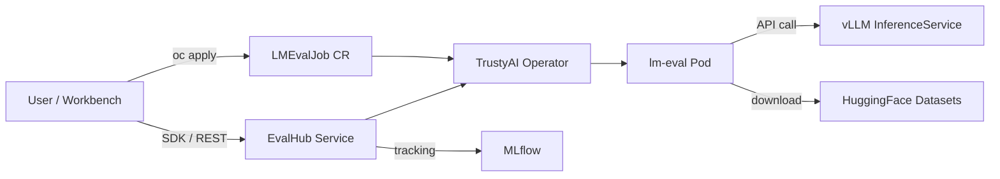

# RHOAI LMEval Builder Lab

A hands-on workshop for running **Korean language evaluation benchmarks** on **Red Hat OpenShift AI** using the TrustyAI `LMEvalJob` Custom Resource. This lab guides you through evaluating open-weight LLMs on datasets like KMMLU, CLIcK, KoBEST, and HAE-RAE directly from your OpenShift AI environment.

## Architecture



**How it works:**

- **LMEvalJob (Phase 1–3):** Submit an `LMEvalJob` YAML directly to OpenShift. The TrustyAI Operator creates a Pod running [lm-evaluation-harness](https://github.com/EleutherAI/lm-evaluation-harness) that downloads datasets and sends inference requests to your model.
- **EvalHub (Phase 4):** Use the [EvalHub](https://github.com/eval-hub/eval-hub) REST API / Python SDK to orchestrate evaluations across multiple frameworks (lm-eval, RAGAS, LightEval, GuideLLM, etc.) with built-in **MLflow** experiment tracking.

## Model

This workshop uses **Gemma 4 (E2B-it)** deployed on OpenShift AI via a custom vLLM ServingRuntime as the target model for evaluation. The setup notebook includes instructions for deploying the model with GPU support.

## What's Included

### 0. Setup

- **0_setup/0_model_deploy.ipynb**: Deploy a Gemma 4 model using a custom vLLM ServingRuntime with NVIDIA GPU support.
- **0_setup/1_LMEval_setup.ipynb**: Configure RBAC permissions, create secrets (HF token, SA token for OAuth), and verify cluster access for LMEvalJob.
- **0_setup/2_eval_hub_setup.ipynb**: Deploy the EvalHub service and MLflow on OpenShift, install the eval-hub-sdk, and verify connectivity.

### 1. Built-in Tasks (Phase 1)

- **1_builtin_tasks/1_builtin_task_eval.ipynb**: Run evaluations using `taskNames` — the simplest approach leveraging TrustyAI's built-in task support.

### 2. Custom Tasks (Phase 2)

- **2_custom_tasks/1_custom_task_eval.ipynb**: Run evaluations using `customTasks` with a Git source — pull any task from the lm-evaluation-harness repository for full flexibility.

### 3. LMEvalJob Benchmark (Phase 3)

- **3_lmeval_job_benchmark/1_lmeval_benchmark.ipynb**: Analyze and compare LMEvalJob evaluation results across models. Load results from JSON, aggregate by category/supercategory, and export to Markdown.
- **3_lmeval_job_benchmark/generate_report.py**: Generate a standalone HTML report with interactive charts and comparison tables from evaluation result logs.

### 4. EvalHub Benchmark (Phase 4)

- **4_eval_hub_benchmark/1_eval_hub_benchmark.ipynb**: Run evaluations through the EvalHub REST API using the Python SDK. Supports multi-benchmark jobs, automatic MLflow tracking, and centralized result management.

## Korean Benchmark Datasets

| Dataset | Description | Categories | Samples |
|---------|-------------|------------|---------|
| **KMMLU** | Korean Massive Multi-task Language Understanding | 45 subjects (STEM, HUMSS, Applied Science) | 35,030 |
| **CLIcK** | Cultural and Linguistic Intelligence in Korean | 11 categories (Culture + Language) | 1,995 |
| **KoBEST** | Korean Balanced Evaluation of Significant Tasks | WiC, CoPA, BoolQ, HellaSwag, SentiNeg | 6,100+ |
| **HAE-RAE** | Korean Language Proficiency Benchmark | 6 categories (General Knowledge, History, etc.) | 1,538 |

## Evaluation Results

We evaluated **Gemma 4 (E2B-it)** on 5 Korean benchmarks using the custom `korean-mcq` EvalHub adapter with up to 2,000 samples per dataset. Evaluations were orchestrated via EvalHub SDK, with results tracked in MLflow.

| Benchmark | Accuracy | Samples |
|:----------|-------:|-------:|
| CLIcK | 56.11% | 1,995 |
| HAE-RAE Bench 1.1 | 51.90% | 2,000 |
| KMMLU (0-shot) | 36.45% | 2,000 |
| KMMLU-HARD (0-shot) | 23.70% | 2,000 |
| KoBEST BoolQ | 85.90% | 1,404 |

<details>
<summary>CLIcK — Accuracy by supercategory</summary>

| supercategory | gemma4-e2b |
|:---|---:|
| Culture | 57.76 |
| Language | 52.16 |

</details>

<details>
<summary>CLIcK — Accuracy by category</summary>

| category | gemma4-e2b |
|:---|---:|
| Economy | 72.88 |
| Functional | 58.57 |
| Geography | 65.55 |
| Grammar | 31.67 |
| History | 34.29 |
| Law | 44.75 |
| Politics | 67.86 |
| Pop Culture | 68.29 |
| Society | 71.52 |
| Textual | 67.55 |
| Tradition | 67.12 |

</details>

<details>
<summary>HAE-RAE — Accuracy by category</summary>

| category | gemma4-e2b |
|:---|---:|
| correct_definition_matching | 59.40 |
| csat_geo | 53.85 |
| csat_law | 21.74 |
| csat_socio | 31.58 |
| date_understanding | 39.29 |
| general_knowledge | 39.87 |
| history | 55.85 |
| loan_words | 83.93 |

</details>

<details>
<summary>KMMLU — Accuracy by supercategory</summary>

| supercategory | gemma4-e2b |
|:---|---:|
| HUMSS | 31.00 |
| Other | 36.74 |

</details>

<details>
<summary>KMMLU — Accuracy by category</summary>

| category | gemma4-e2b |
|:---|---:|
| Accounting | 31.00 |
| Agricultural Sciences | 33.80 |
| Aviation Engineering and Maintenance | 40.00 |

</details>

<details>
<summary>KMMLU-HARD — Accuracy by supercategory</summary>

| supercategory | gemma4-e2b |
|:---|---:|
| Other | 23.70 |

</details>

<details>
<summary>KMMLU-HARD — Accuracy by category</summary>

| category | gemma4-e2b |
|:---|---:|
| accounting | 15.22 |
| biology | 14.00 |
| chemistry | 34.00 |
| computer_science | 29.00 |
| criminal_law | 26.00 |
| ecology | 28.00 |
| electrical_engineering | 22.00 |
| electronics_engineering | 22.00 |
| gas_technology_and_engineering | 25.00 |
| geomatics | 30.00 |
| health | 34.78 |
| information_technology | 23.00 |
| korean_history | 9.09 |
| machine_design_and_manufacturing | 17.39 |
| management | 20.00 |
| maritime_engineering | 16.00 |
| materials_engineering | 27.00 |
| math | 20.00 |
| nondestructive_testing | 27.00 |
| patent | 23.53 |
| political_science_and_sociology | 25.56 |
| public_safety | 29.00 |
| railway_and_automotive_engineering | 20.00 |

</details>

<details>
<summary>KoBEST BoolQ — Accuracy by category</summary>

| category | gemma4-e2b |
|:---|---:|
| unknown | 85.90 |

</details>

Accumulated benchmark results across major open-weight models are maintained at:

> **[evaluate-llm-on-korean-dataset](https://github.com/hyogrin/evaluate-llm-on-korean-dataset)**

This companion repository tracks performance of models like Gemma, Llama, Phi, Qwen, and others on Korean evaluation datasets with detailed per-category breakdowns and radar chart visualizations.

## Prerequisites

- Red Hat OpenShift AI cluster with TrustyAI Operator installed
- A model deployed via KServe (vLLM runtime) with OAuth auth enabled
- `oc` CLI access to the cluster
- A Hugging Face account with access to gated models/tokenizers (e.g., `google/gemma-2b`)
- Hugging Face API token
- (Phase 4) EvalHub service and MLflow deployed on the cluster

## Quick Start

1. Clone this repo into your OpenShift AI Workbench:
   ```bash
   git clone https://github.com/hyogrin/lm-eval-builder-lab.git
   cd lm-eval-builder-lab
   ```

2. Install dependencies with [uv](https://docs.astral.sh/uv/):
   ```bash
   uv sync
   source .venv/bin/activate
   ```

3. Copy and fill in environment variables:
   ```bash
   cp sample.env .env
   # Edit .env with your values
   ```

4. Run notebooks in order:
   - `0_setup/0_model_deploy.ipynb` — Deploy Gemma 4 model (skip if already deployed)
   - `0_setup/1_LMEval_setup.ipynb` — One-time RBAC and secrets setup for LMEvalJob
   - `0_setup/2_eval_hub_setup.ipynb` — Deploy EvalHub + MLflow (for Phase 4)
   - `1_builtin_tasks/1_builtin_task_eval.ipynb` — Quick eval with built-in tasks
   - `2_custom_tasks/1_custom_task_eval.ipynb` — Full eval with any task from Git
   - `3_lmeval_job_benchmark/1_lmeval_benchmark.ipynb` — Analyze LMEvalJob results and generate reports
   - `4_eval_hub_benchmark/1_eval_hub_benchmark.ipynb` — Run evaluations via EvalHub SDK with MLflow tracking

> **Note:** `uv sync` creates a `.venv` virtual environment and installs all dependencies defined in `pyproject.toml`. To run scripts directly, use `uv run python <script>` or activate the venv with `source .venv/bin/activate`.

## Phase Comparison

| | Phase 1: Built-in Tasks | Phase 2: Custom Tasks (Git) | Phase 3: LMEvalJob Benchmark | Phase 4: EvalHub Benchmark |
|---|---|---|---|---|
| **Approach** | `taskList.taskNames` | `taskList.customTasks.source.git` + `taskNames` | Post-processing result JSONs | EvalHub SDK / REST API |
| **Task Source** | TrustyAI built-in (Tier 1/2) | Any task from lm-evaluation-harness | N/A (consumes results) | Multiple frameworks (lm-eval, RAGAS, etc.) |
| **Available Korean Tasks** | kmmlu_direct_law, kobest_wic, haerae_history, etc. | Full kmmlu (45 subjects), click (11 categories), kobest, etc. | All tasks from Phase 1 & 2 | All tasks + multi-framework support |
| **Setup Complexity** | Minimal | Requires git URL + path | Requires result JSON files | Requires EvalHub + MLflow deployment |
| **Experiment Tracking** | Manual (Pod logs) | Manual (Pod logs) | Manual (JSON export) | Built-in MLflow integration |
| **Best For** | Quick smoke tests, CI/CD | Full benchmark suites, custom evaluations | Visualization, reporting, comparison | Production workflows, multi-framework eval |

## About

This workshop was built through real debugging and iteration on OpenShift AI. Key learnings documented:

- LMEvalJob CRD uses `spec.pod.container.env` (singular), not `spec.pod.containers[].env`
- OAuth-protected InferenceServices require RBAC + SA token via `OPENAI_API_KEY` env var
- The `served_model_name` in vLLM equals the InferenceService metadata name
- SSL verification must be disabled for self-signed certs (`verify_certificate: "False"`)
